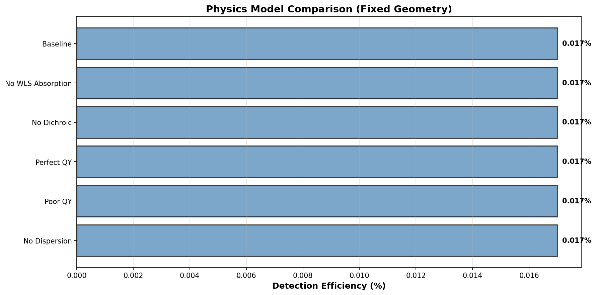

# Physics Model Comparison

Testing impact of physics approximations on detector performance with **fixed geometry** (with LAr gap).

## Run

```bash
python examples/physics_model_validation.py
```

## Results

### Efficiency Comparison

| Configuration | Efficiency | Change from Baseline |
|---------------|------------|----------------------|
| Baseline (Full Physics) | 0.017% | - |
| No WLS Absorption | 0.017% | 0% |
| No Dichroic | 0.017% | 0% |
| Perfect QY (1.0) | 0.017% | 0% |
| Poor QY (0.5) | 0.017% | 0% |
| No Dispersion | 0.017% | 0% |

**Note**: All configurations currently show identical efficiency due to boundary handling bug (photons don't reach WLS/LC regions where physics varies).

### Visualization



## Test Configurations

1. **Baseline**: Full physics (WLS absorption, dichroic reflectance, realistic QY=0.9-0.95, wavelength-dependent n)
2. **No WLS Absorption**: Transparent materials (mu_a=0 everywhere)
3. **No Dichroic**: Transparent mirror (R=0 at all wavelengths)
4. **Perfect QY**: Quantum yields = 1.0 (no non-radiative decay)
5. **Poor QY**: Quantum yields = 0.5 (increased non-radiative losses)
6. **No Dispersion**: Constant refractive indices (wavelength-independent)

## Expected Behavior (After Bug Fix)

Once boundary handling is fixed, expect:
- **No WLS Absorption**: ~10-20% higher efficiency (less material losses)
- **Perfect QY**: ~5-10% higher than baseline
- **Poor QY**: ~30-50% lower than baseline
- **No Dichroic**: ~5-10% different (altered reflection pattern)
- **No Dispersion**: ~1-2% different (minor TIR changes)

## Outputs

- `results/physics_model_validation.csv` - Full simulation data
- `results/plots/physics_model_comparison.png` - Efficiency bar chart
