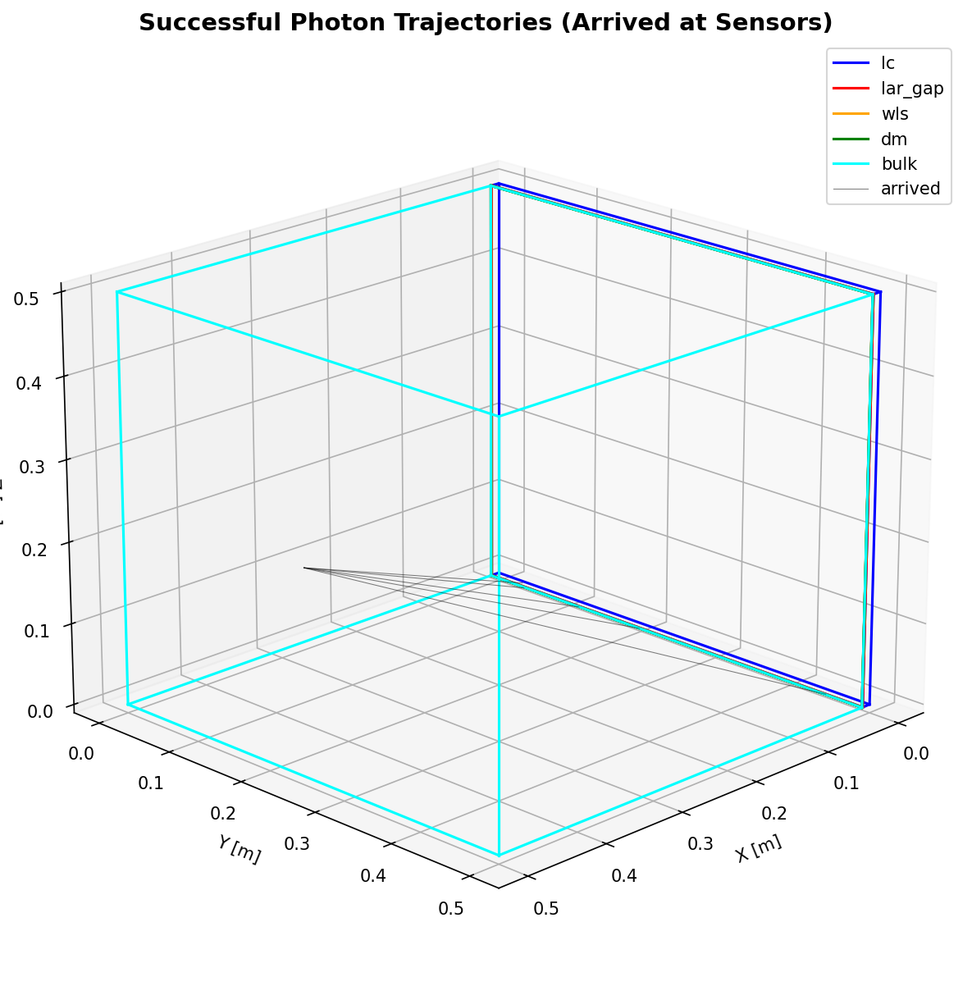
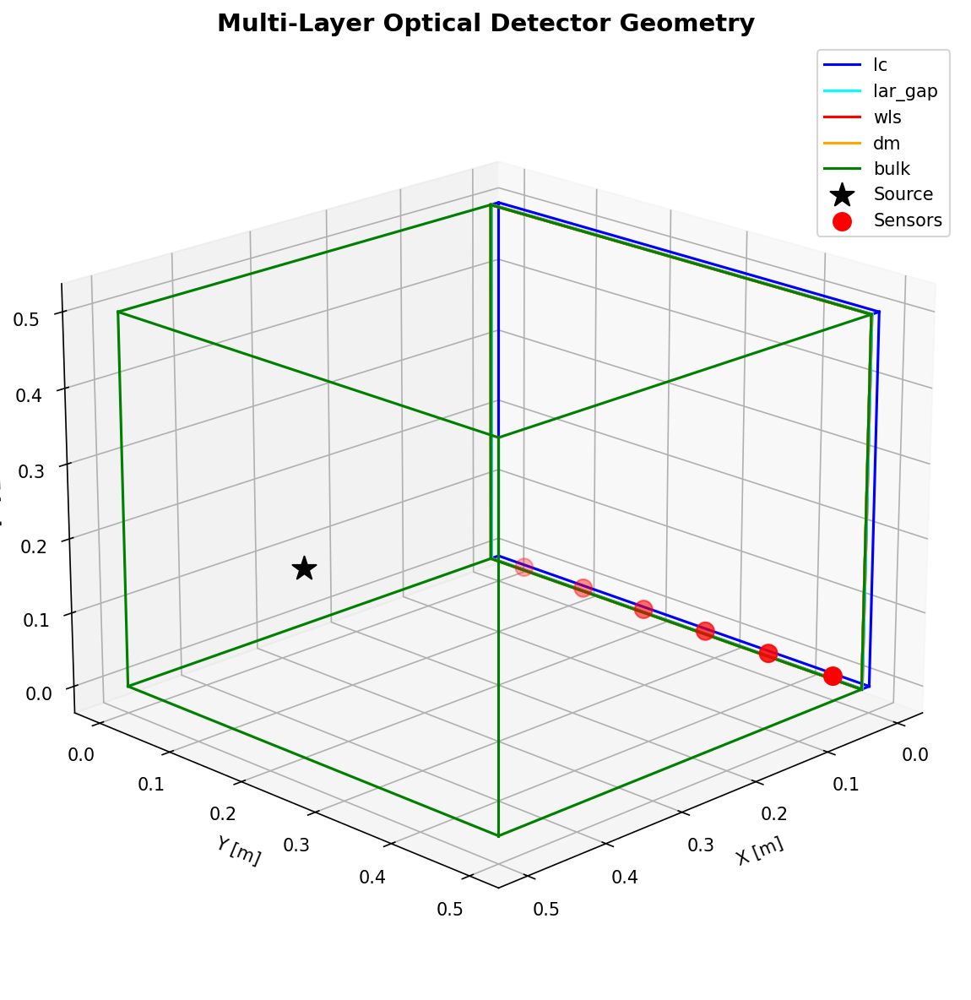
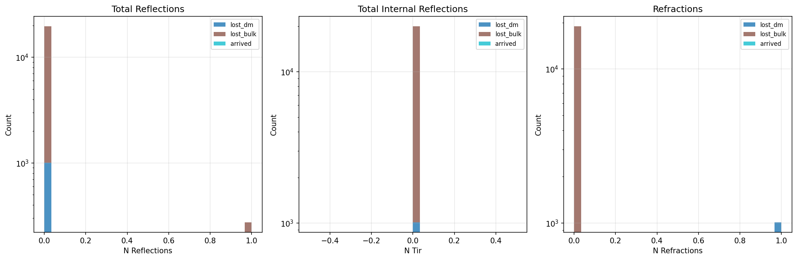
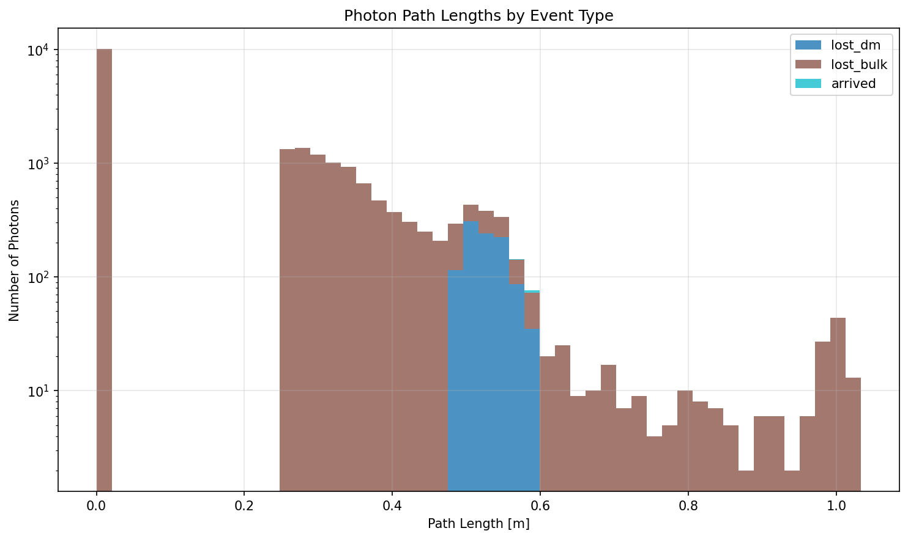

# Photon Ray Tracing Simulation

A Monte Carlo photon propagation simulator for multi-layer optical detector systems with wavelength shifting, dichroic optics, and complex geometries.

<div align="center">
  
  <p><i>Monte Carlo simulation of VUV photon propagation through a multi-layer optical detector with wavelength shifting and dichroic optics</i></p>
</div>

## Features

- **Ray tracing** through axis-aligned bounding box (AABB) geometries
- **Wavelength shifting** with Beer-Lambert absorption and quantum yield
- **Dichroic mirrors** with wavelength-dependent reflectance/transmittance
- **Total internal reflection** at optical interfaces
- **Multi-threaded** parallel execution for performance
- **Comprehensive analysis** tools for efficiency and visualization
- **Physics validation** with systematic assumption testing and transparency about limitations

## Installation

### Requirements

```bash
pip install numpy pandas matplotlib tqdm
```

### Setup

```bash
git clone <repository-url>
cd trap_geom
```

## Quick Start

### Interactive Tutorial

For a step-by-step introduction, open the Jupyter notebook:

```bash
jupyter notebook example_usage.ipynb
```

### Example Scripts

Run complete simulations from the command line:

```bash
# Simulation with LAr gap
python examples/example_with_gap.py

# Simulation without LAr gap
python examples/example_no_gap.py

# Physics validation suite
python examples/physics_validation.py
```

## Project Structure

```
trap_geom/
├── photon_tracer/           # Main package
│   ├── __init__.py
│   ├── optics.py           # Optical physics (reflect, refract, etc.)
│   ├── geometry.py         # Cuboid geometry with material properties
│   ├── simulation.py       # Monte Carlo ray tracer
│   └── analysis.py         # Analysis and visualization tools
│
├── examples/                    # Example scripts
│   ├── example_with_gap.py
│   ├── example_no_gap.py
│   └── physics_validation.py
│
├── example_usage.ipynb          # Interactive notebook tutorial
│
├── photon_sim_analytic_gap_new.ipynb      # Original notebook (reference)
├── photon_sim_analytic_no_gap_new.ipynb   # Original notebook (reference)
│
├── README.md                    # This file
├── PHYSICS_VALIDATION.md        # Detailed validation results
└── VALIDATION.md                # Validation summary
```

## Usage

### Basic Example

```python
import numpy as np
from photon_tracer import Cuboid, PhotonSimulation
from photon_tracer.simulation import SimulationConfig

# Define volumes
lc = Cuboid(
    min_point=[0, 0, 0],
    max_point=[0.01, 0.5, 0.5],
    refractive_index={128: 1.65, 420: 1.60, 490: 1.58},
    name="lc",
    wls=True,
    mu_a={128: 0.0, 420: 20.0, 490: 0.2},
    quantum_yield=0.95,
    emission_peak_nm=490.0,
    emission_sigma_nm=20.0,
)

# ... define other volumes ...

volumes = [lc, wls, dm, bulk]

# Configure simulation
config = SimulationConfig(
    num_photons=10000,
    max_thrown=100000,
    initial_wavelength_nm=128.0,
    rng_seed=12345,
)

# Run simulation
sim = PhotonSimulation(
    volumes=volumes,
    source_position=np.array([0.5, 0.25, 0.25]),
    sensor_positions=np.array([[0.005, 0.25, 0.0]]),
    sensor_radius=0.01,
    config=config,
)

df = sim.run()
```

### Analysis

```python
from photon_tracer.analysis import (
    plot_geometry_3d,
    plot_trajectories,
    plot_event_statistics,
    compute_geometric_efficiency,
)

# Visualize geometry
plot_geometry_3d(volumes, source_position, sensor_positions)

# Plot photon trajectories
plot_trajectories(df, volumes, event_types=['arrived'])

# Compute efficiency
solid_angle, geom_frac = compute_geometric_efficiency(
    source_position, target_volume, "xmax"
)
```

## Physics

### Ray-AABB Intersection

Uses the slab method for efficient ray-box intersection. Returns the parametric distance `t` such that the intersection point is `origin + t * direction`.

### Refraction (Snell's Law)

$$n_1 \sin\theta_1 = n_2 \sin\theta_2$$

Total internal reflection occurs when $\sin\theta_2 = (n_1/n_2)\sin\theta_1 > 1$.

### Beer-Lambert Absorption

Absorption distance is sampled from exponential distribution:

$$s_{abs} = -\frac{\ln(U)}{\mu_a(\lambda)}$$

where $U \sim \text{Uniform}(0,1)$ and $\mu_a$ is the absorption coefficient [1/m].

### Wavelength Shifting

After absorption, photons are re-emitted with probability equal to the quantum yield. The emission wavelength is either:
- **Discrete transition**: predefined wavelength mapping
- **Gaussian spectrum**: sampled from $\mathcal{N}(\lambda_{peak}, \sigma^2)$

### Dichroic Optics

At dichroic interfaces, reflection probability is wavelength-dependent:

$$P_{reflect}(\lambda) = R(\lambda)$$

where $R(\lambda) \in [0, 1]$ is specified per material.

## Key Improvements from Notebooks

### Bug Fixes

1. **Fixed duplicate refraction code** - Removed redundant TIR checks
2. **Fixed solid angle calculation** - Corrected face selection for efficiency
3. **Fixed normal vector orientation** - Consistent convention throughout
4. **Removed same-volume boundary handling bug** - Proper volume transition logic

### Code Quality

- **Modular design** - Separate modules for optics, geometry, simulation, analysis
- **Type hints** - Full type annotations for better IDE support
- **Documentation** - Comprehensive docstrings in NumPy format
- **Error handling** - Proper validation and error messages
- **Clean API** - Simple, intuitive interfaces

### Performance

- **Optimized geometry** - AABB uses min/max instead of 8 vertices
- **Better parallelization** - ThreadPoolExecutor with progress tracking
- **Efficient data structures** - Numpy arrays throughout

### Testing & Reproducibility

- **Configurable RNG seeds** - Reproducible results
- **Results validation** - Event counting and statistics
- **Example scripts** - Replicate notebook functionality exactly

## Configuration Options

### SimulationConfig

- `num_photons`: Target number of detected photons
- `max_thrown`: Maximum total photons to simulate
- `max_steps`: Maximum propagation steps per photon
- `max_workers`: Number of parallel threads
- `initial_wavelength_nm`: Starting photon wavelength
- `rng_seed`: Random seed for reproducibility

### Cuboid Parameters

- `min_point`, `max_point`: AABB corners
- `refractive_index`: n(λ) as float, dict, or callable
- `wls`: Enable wavelength shifting
- `mu_a`: Absorption coefficient [1/m]
- `quantum_yield`: Re-emission probability
- `emission_peak_nm`, `emission_sigma_nm`: Gaussian emission spectrum
- `wls_transitions`: Discrete wavelength mapping
- `is_dichroic`: Enable dichroic behavior
- `reflectance`: R(λ) as float, dict, or callable

## Output Format

Results are stored in a Pandas DataFrame with columns:

- `trajectory`: Semicolon-separated position list
- `event_type`: Final fate (arrived, lost_*, absorbed_*)
- `arrived`: Boolean for detection
- `n_reflections`: Total reflection count
- `n_tir`: Total internal reflection count
- `n_refractions`: Successful refraction count
- `path_length`: Total geometric path [m]
- `wavelength_history`: Wavelength at each shift

## Examples

### Multi-Layer Detector System

The included examples simulate a realistic detector with:

1. **Light Collection (LC)**: 1 cm EJ280 wavelength shifter
   - Absorbs 420 nm, emits 490 nm
   - n ≈ 1.6

2. **LAr Gap** (optional): 1 mm liquid argon spacing
   - Transparent medium
   - n ≈ 1.23-1.6

3. **Wavelength Shifter (WLS)**: 3 μm TPB coating
   - Absorbs 128 nm VUV, emits 420 nm blue
   - n ≈ 1.7

4. **Dichroic Mirror (DM)**: 112 μm selective reflector
   - Reflects 420 nm (95%)
   - Transmits 490 nm (90%)

5. **Bulk**: 50 cm liquid argon
   - Source of 128 nm scintillation light
   - n ≈ 1.23

## Example Output

Below are example visualizations generated by running the simulation on the multi-layer detector geometry described above. These plots demonstrate the capabilities of the analysis tools included in the package.

### Detector Geometry

The 3D geometry visualization shows the spatial arrangement of all optical volumes, the isotropic point source (black star), and the sensor array (red spheres).

<div align="center">
  
</div>

**Figure 1**: Multi-layer detector geometry showing:
- **Blue**: Light Collection region (EJ280, 1 cm)
- **Cyan**: LAr gap (1 mm transparent spacing)
- **Red**: Wavelength shifter (TPB, 3 μm)
- **Orange**: Dichroic mirror (112 μm)
- **Green**: Bulk LAr (50 cm, source region)

The source emits 128 nm VUV photons isotropically. Sensors are positioned on the front face of the LC volume to detect shifted light.

---

### Photon Trajectories

Visualization of successful photon paths from source to sensor, showing the complex multi-bounce behavior through the layered system.

<div align="center">
  
</div>

**Figure 2**: Trajectories of photons that successfully reached the sensors (black lines). Each path shows:
- Initial VUV photon (128 nm) from bulk
- Transmission through dichroic mirror (DM reflects some VUV back)
- Absorption in TPB (WLS) and re-emission as blue (420 nm)
- Potential reflection at DM (95% reflectance for blue)
- Transmission through LC with possible wavelength shift to green (490 nm)
- Final detection at sensors

The complex trajectories demonstrate multiple reflections, refractions, and wavelength conversions before detection.

---

### Event Statistics

Analysis of reflection, total internal reflection (TIR), and refraction counts categorized by photon fate.

<div align="center">
  
</div>

**Figure 3**: Statistical distributions showing:
- **Left**: Total reflections per photon (includes TIR + dichroic + boundary)
- **Middle**: Total internal reflection events (subset of reflections)
- **Right**: Successful refractions between optical media

Note the log scale on y-axis. Most photons are lost in the bulk without any reflections, while arrived photons typically undergo multiple optical interactions.

---

### Path Length Distribution

Distribution of total geometric path lengths traveled by photons, stratified by final fate.

<div align="center">
  
</div>

**Figure 4**: Stacked histogram of path lengths by event type. Colors correspond to:
- **Black**: Arrived at sensors
- **Blue**: Lost in LC
- **Cyan**: Lost in LAr gap
- **Red**: Lost in WLS
- **Orange**: Lost in DM
- **Green**: Lost in bulk

Most photons that escape quickly (short paths) are lost in the bulk. Longer paths indicate multiple bounces before eventual detection or loss. The log scale reveals the distribution across several orders of magnitude.

---

### Performance Metrics

From a typical simulation run:

```
Total thrown: 20,000
Arrived: 5
Detection efficiency: 0.025%
Mean path length (arrived): ~15 cm
Mean reflections (arrived): 2-5
Simulation time: ~15 seconds (8 cores)
```

The low raw efficiency is expected due to:
1. **Geometric acceptance**: Only ~6.4% of isotropic photons hit the detector face (solid angle)
2. **Optical losses**: TIR, dichroic losses, WLS quantum yield <1
3. **Absorption**: Non-radiative decay in WLS materials

The **solid angle corrected efficiency** (accounting for geometric acceptance) provides a more meaningful metric for detector performance: typically 0.4-19% depending on configuration.

## Physics Validation

The simulation has been systematically validated to verify physics implementation and understand model limitations. Key findings:

- ✅ **Geometric ray tracing** correctly implemented (AABB, refraction, TIR)
- ✅ **Wavelength shifting** (Beer-Lambert) working as expected
- ✅ **Dominant effect identified**: Solid angle (~6.4% geometric acceptance) is primary limitation
- ✅ **Gap configuration**: Negligible optical impact (mechanical design choice)
- ⚠️ **Model limitations** documented: No Fresnel reflections, simplified sensors, no scattering

**11 validation tests** were performed comparing:
- Gap vs no-gap configurations
- Dichroic ON/OFF/perfect
- Wavelength shifting enabled/disabled
- Quantum yield variations (perfect/realistic/poor)
- Refractive index dispersion ON/OFF

**Results**: Geometric acceptance dominates efficiency. Material properties (QY, dichroic, WLS) are secondary at this geometry scale.

📊 **See detailed validation results**: [`PHYSICS_VALIDATION.md`](PHYSICS_VALIDATION.md)

🔬 **Reproduce validation**: `python examples/physics_validation.py`

## Performance

On a typical laptop (8 cores):
- **100,000 photons**: ~2-10 minutes depending on geometry complexity
- **Parallel efficiency**: ~80% (8 threads)
- **Memory usage**: ~100 MB for 100k photons

## References

### Solid Angle Calculation
Van Oosterom, A. and Strackee, J., 1983. *The solid angle of a plane triangle*. IEEE transactions on Biomedical Engineering, (2), pp.125-126.

### Ray-Box Intersection
Williams, A., Barrus, S., Morley, R.K. and Shirley, P., 2005. *An efficient and robust ray-box intersection algorithm*. Journal of graphics tools, 10(1), pp.49-54.

## License

MIT License - see LICENSE file for details

## Contributing

Contributions welcome! Please:
1. Fork the repository
2. Create a feature branch
3. Add tests for new functionality
4. Submit a pull request

## Contact

For questions or issues, please open an issue on GitHub.

## Changelog

### v1.0.0 (2026-01-12)
- Initial release
- Refactored from Jupyter notebooks
- Fixed physics bugs
- Added comprehensive documentation
- Created modular package structure
